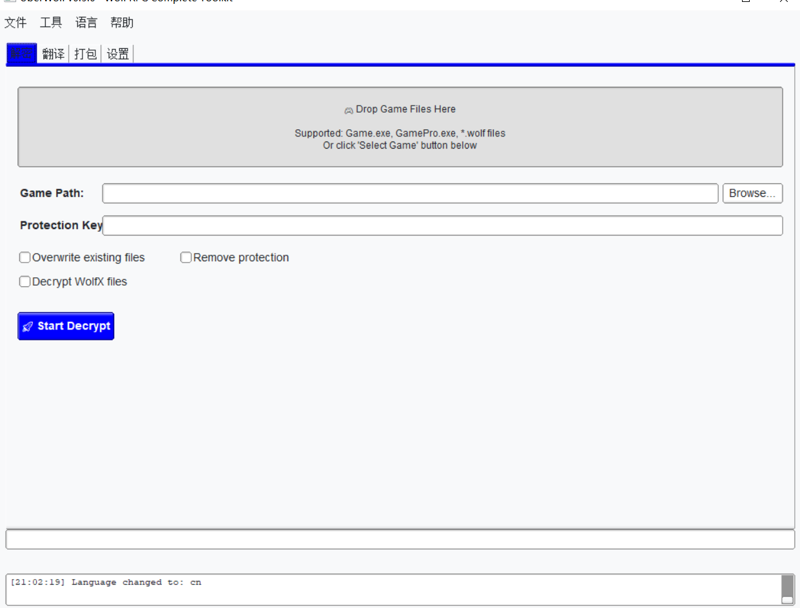

# UberWolf GUI

[English](README.en.md) | 中文


功能齐全的基于GUI的Wolf RPG解密工具，支持Wolf RPG Pro。



### 功能特点

> *原文：Features*
 - 图形用户界面应用程序
 - 简单易用，基于拖放操作
 - 支持所有可能的文件扩展名
 - 自动检测解密密钥
 - 检测Pro编辑器的***保护密钥***（如果存在）

### 支持的文件扩展名
> *原文：Supported File Extensions*
 - .wolf
 - .data
 - .pak
 - .bin
 - .assets
 - .content
 - .res
 - .resource

## 使用方法 - 完整游戏处理
> *原文：Usage - Full Game Processing*
- 将***Game.exe***或***GamePro.exe***拖放到指定区域，或使用***选择游戏***按钮选择它。
- 按下处理按钮解压所有归档文件，并在存在的情况下检测***保护密钥***。

## 使用方法 - 提取一个或多个归档
> *原文：Usage - Extract One or More Archives*
 将归档文件拖放到指定区域，然后等待文件被提取。

----

# UberWolfCli
> *原文：Simple command line interface to decrypt Wolf RPG games.*

用于解密Wolf RPG游戏的简单命令行界面。

## 使用方法
> *原文：Usage*
 UberWolfCli的使用方法与GUI应用程序非常相似：
 - 将***Game.exe***或***GamePro.exe***拖放到可执行文件上，自动检测数据文件夹并解密所有文件。
 - 将***文件夹***拖放到可执行文件上，提取其中所有支持的wolf文件。
 - 将一个或多个支持的文件（例如***.wolf***）拖放到可执行文件上，提取它们。
 - 从命令行调用，如下所示：
```bash
# 完全自动检测
UberWolfCli.exe "D:\Path to Game\Game.exe"
# 使用文件夹，例如Data
UberWolfCli.exe "D:\Path to Game\Data"
# 解压单个文件
UberWolfCli.exe "D:\Path to Game\Data\BasicData.wolf"
```

----

# 本地化

> *原文：Localization*

请查看[本地化指南](doc/localization.md)获取将应用程序翻译成您的语言的信息。

### 贡献者
> *原文：Credits*
- 日语（机器翻译）- Brothers3398
- 韩语（机器翻译）- Brothers3398
- 中文 - Raylern